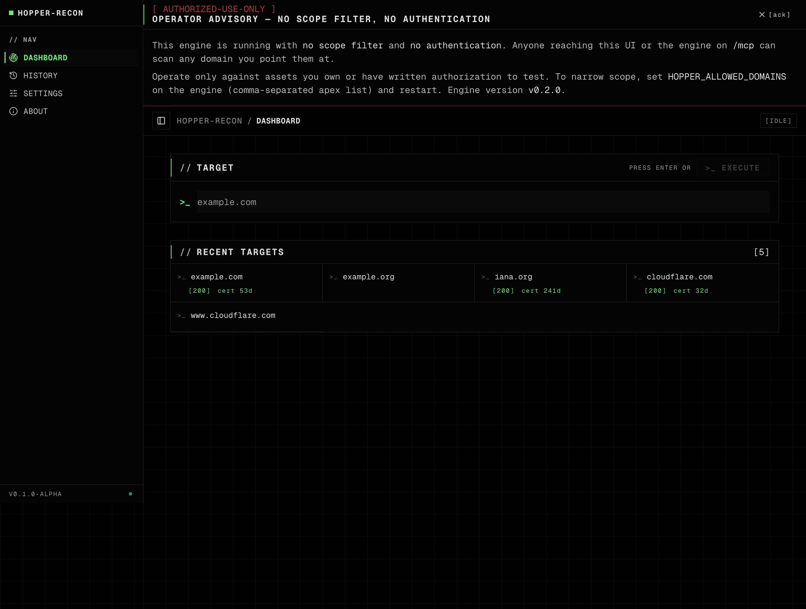
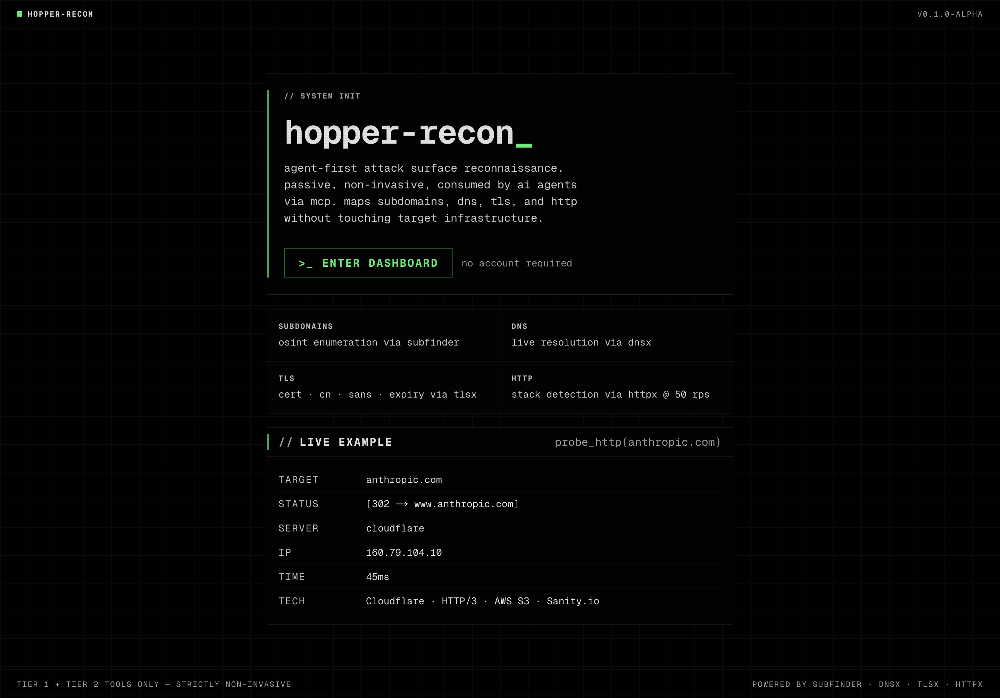
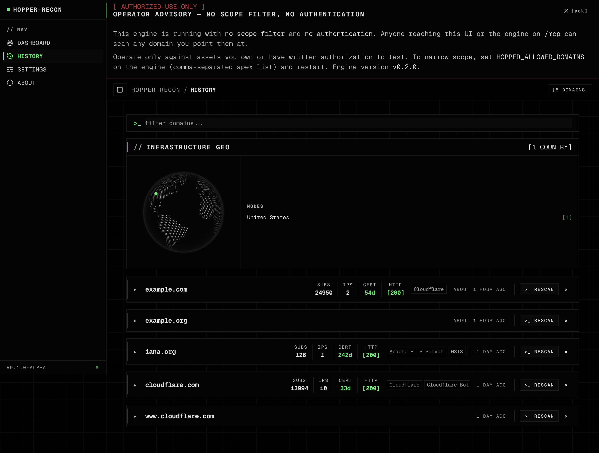
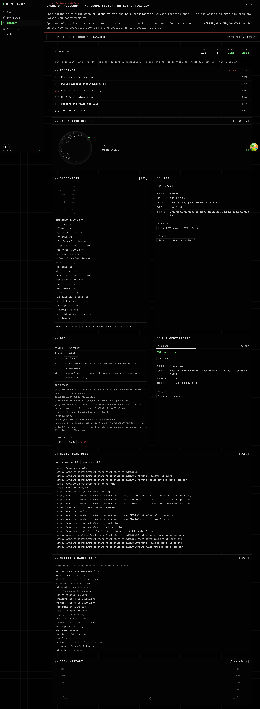

# hopper-recon

Self-hosted, MCP-native security reconnaissance dashboard. A **Go engine** wraps the [projectdiscovery](https://github.com/projectdiscovery) OSINT tooling and owns its own SQLite; a **Next.js 16 dashboard** is a thin HTTP client on top. AI agents (Claude Code / Cline / Claude Desktop) can attach to the same engine over MCP and use the recon tools directly.


> ## Authorized use only
>
> Hopper Recon sends DNS, TLS handshake, and HTTP traffic to any target you give it. **Run only against assets you own or have written authorization to test.** Outbound footprint per scan against a single target is roughly **5 DNS queries + 1 TLS handshake + 1 HTTP GET** — equivalent to one browser tab. It is not a stealth tool: HTTP probes identify themselves with a `hopper-recon/<version> (+https://github.com/iksnerd/hopper-recon)` User-Agent so target operators can attribute traffic and request exclusion.
>
> The maintainers do not consent to use of this software against unauthorized third-party infrastructure. See [SECURITY.md](./SECURITY.md) for the full posture and disclosure contact.



---

## Features

- **Dashboard** — runs all OSINT tools in parallel against a target, live elapsed timers, findings triage strip, tech stack detection
- **History** — per-domain timeline with multi-scan charts, geo-globe from IP data, full-page detail view with scrollable subdomain list, cert SAN expansion, redirect chains
- **MCP-native engine** — exposes the same tools at `/mcp` so AI agents drive recon directly; the dashboard is just one consumer
- **Findings strip** — auto-triages expired certs, missing SPF/DMARC, HTTPS→HTTP downgrades, sensitive subdomains
- **Geo globe** — IP → country via bundled MaxMind GeoLite2 (offline), rendered with [cobe](https://cobe.vercel.app)
- **Self-hosted** — `docker compose up` to a working install. SQLite for storage, no external services required
- **Continuous backup via Litestream** — WAL streaming to a local file volume by default; flip a config block to replicate to S3 / R2 / Azure Blob / GCS instead
- **No Docker socket on the web** — the web container talks to the engine over HTTP, so it runs on platforms that forbid privileged containers (Cloud Run, Fly Machines, k8s rootless, etc.)

---

## Built-in protections

These ship enabled by default. They live at the **engine** layer (not the web), so direct MCP callers — Claude Code, Cline, one-shot stdio agents — hit the same gates as the dashboard. Full posture in [SECURITY.md](./SECURITY.md); env knobs in [`.env.example`](./.env.example).

| Protection | What it does | Override |
|---|---|---|
| **Restricted-suffix blocklist** | Refuses active probes (`probe_http`, `fetch_tls_cert`) against `.gov`, `.mil`, `.gouv.fr`, `.gov.uk`, `.go.jp`, `.gc.ca`, `.gov.au`. Returns HTTP 451. | `HOPPER_OVERRIDE_BLOCKLIST=true` + non-empty `HOPPER_BLOCKLIST_OVERRIDE_REASON` (audit-logged) |
| **Per-target cooldown** | 60s window per `(target, tool)` pair. Repeats return HTTP 429 with `Retry-After`. Stops mash-the-button accidents. | None — wait it out |
| **Audit log** | Every `/scan` writes one row to `audit_log` with timestamp, source IP, User-Agent, tool, target, decision (allowed / blocked), and reason. | Read with `sqlite3 /data/scans.db 'SELECT * FROM audit_log'` |
| **Scope filter** | When `HOPPER_ALLOWED_DOMAINS` is set, all tools refuse targets outside the listed apexes. Returns HTTP 403. | Unset or extend the list |
| **Custom User-Agent** | `httpx` probes carry `hopper-recon/<version> (+repo URL)` so target operators can attribute and request exclusion. | None — set on every request by design |
| **Operator advisory banner** | First-boot UI banner when neither scope nor auth is configured. Dismissable per-browser. | Configure scope or live with the nag |
| **Loopback engine bind** | Compose binds engine to `127.0.0.1:9119` only. LAN/WAN exposure requires deliberate config change. | Edit `docker-compose.yml` ports + put auth in front first |

`/api/scan` and the engine respond with `X-Hopper-Recon: authorized-use-only` so any reverse-proxy or CDN log identifies the tool.

The `/config` endpoint on the engine reports scope/auth state as booleans (no env values leaked) — used by the dashboard banner and useful for monitoring.

---

## Screenshots

| | |
|---|---|
| **Landing** — `/` shows what the tool does, with a static example. | **History** — `/history` lists every scanned domain with cert/HTTP/tech metadata, geo distribution, scan-recency. |
|  |  |
| **Dashboard** — `/dashboard` runs all OSINT tools in parallel against a target. Recent targets idle state appears when no scan is active. The advisory banner appears when neither `HOPPER_ALLOWED_DOMAINS` nor authentication is configured. | **Domain detail** — `/history/<domain>` shows the full picture: findings strip, geo globe, subdomain breakdown with category histogram, full HTTP/DNS/TLS panels, scan timeline. |
|  |  |

---

## Architecture

```
hopper-recon/
├── engine/             # Go server — HTTP REST + stdio MCP, owns SQLite
│   ├── main.go         # Entrypoint, MCP tool registration
│   ├── tools.go        # Recon-binary runners (subfinder/dnsx/tlsx/httpx/geoip)
│   ├── db.go           # SQLite + queries
│   ├── server.go       # REST handlers + /mcp mount
│   └── Dockerfile
├── web/                # Next.js 16 thin client
│   ├── src/app/        # App Router pages + API routes (proxies to engine)
│   ├── src/lib/        # engine-client.ts · db.ts (D1 + Engine adapters) · scan-parser.ts
│   └── src/components/recon/
├── docker-compose.yml  # Engine + web + Litestream sidecars + volumes
├── litestream.yml      # Replica config — local file (default) or S3 / R2 / Azure / GCS
└── CLAUDE.md           # Agent + dev guide
```

The dashboard's `/api/scan` validates input then forwards to `engine POST /scan`, which atomically runs the tool, writes the row, and returns the result. Reads (`/api/scans/*`) call the engine's REST endpoints via the `EngineDBAdapter` in `web/src/lib/db.ts`. There's a parallel `D1Adapter` for Cloudflare Workers deploys, where the web owns the database directly.

---

## Tools

| MCP name | Binary | What it does |
|---|---|---|
| `passive_subdomains` | subfinder | OSINT subdomain enumeration across 40+ sources (free without keys, more with) |
| `resolve_dns` | dnsx | A / **AAAA** / CNAME / NS / MX / TXT records, CDN detection, DMARC merge from `_dmarc.<host>` |
| `fetch_tls_cert` | tlsx | TLS cert details — CN, SANs, expiry, cipher, wildcard/expired/self-signed flags |
| `probe_http` | httpx | HTTP probe — title, tech stack, JARM, CPE, redirect chain. Custom UA, 50 rps cap |
| `check_cdn` | cdncheck | Per-IP CDN / cloud / WAF attribution from bundled CIDR lists (Cloudflare, Akamai, Fastly, AWS, GCP, Imperva, …). Pure offline. |
| `find_urls` | urlfinder | Historical URLs from passive sources (waybackarchive, commoncrawl, alienvault). No requests to the target. |
| `lookup_geoip` | geoip2-golang | IPs → ISO country codes from a local MaxMind GeoLite2 mmdb. Anycast IPs (Cloudflare / AWS / Google) have no country attribution by design — the dashboard shows an inline note instead of an empty globe. |

**Tools we don't ship**: `asnmap` (requires PDCP API key), `search_hosts` / uncover (requires Shodan/Censys/FOFA keys). Hopper's policy is that every shipped tool must produce useful output for a first-time user without auth setup.

---

## Quick start

**Prerequisites:** Docker + Docker Compose. (For development without containers: Node.js 22+, Go 1.26+.)

```bash
git clone https://github.com/iksnerd/hopper-recon
cd hopper-recon

# Optional: drop in a GeoLite2 mmdb so the geo-globe renders
mkdir -p ~/.config/hopper-recon
curl -L https://github.com/P3TERX/GeoLite.mmdb/raw/download/GeoLite2-Country.mmdb \
     -o ~/.config/hopper-recon/GeoLite2-Country.mmdb

# Bring up the stack
docker compose up -d --build

# Dashboard at http://localhost:3000
# Engine REST + MCP at http://127.0.0.1:9119 (loopback only)
```

The engine binds to `127.0.0.1:9119` on the host (off the well-known `:8080` to avoid colliding with the dozen other dev tools that grab `:8080`). Inside the compose network the engine listens on `:8080` and the web reaches it via DNS at `engine:8080`.

### Adding to your MCP client

For Claude Code (project `.mcp.json`):

```json
{
  "mcpServers": {
    "hopper-recon": {
      "type": "http",
      "url": "http://127.0.0.1:9119/mcp"
    }
  }
}
```

For one-shot stdio agents (Claude Desktop):

```json
{
  "mcpServers": {
    "hopper-recon": {
      "command": "docker",
      "args": ["run", "--rm", "-i", "hopper-recon:latest", "mcp"]
    }
  }
}
```

The HTTP variant connects to your long-running engine and shares the dashboard's database — anything an agent scans shows up in History. The stdio variant spawns a fresh ephemeral container with no persistence.

---

## Configuration

Full reference + commented Litestream cloud-replica blocks live in [`.env.example`](./.env.example). Copy it to `.env` next to `docker-compose.yml`; both engine and Litestream sidecars pick it up automatically.

| Env / file | Default | Purpose |
|---|---|---|
| `ENGINE_URL` | `http://127.0.0.1:9119` (dev) / `http://engine:8080` (compose) | Where the web finds the engine |
| `HOPPER_DB_PATH` | `/data/scans.db` | SQLite path inside the engine container |
| `HOPPER_ADDR` | `:8080` | Engine HTTP listen address |
| `HOPPER_ALLOWED_DOMAINS` | _(unset)_ | Comma-separated apex list; off-scope targets return 403. Unset = scan anything (dashboard then nags) |
| `HOPPER_OVERRIDE_BLOCKLIST` | _(unset)_ | Set to `true` (with `HOPPER_BLOCKLIST_OVERRIDE_REASON`) to allow `.gov` / `.mil` / equivalent probes. Audit-logged. |
| `HOPPER_BLOCKLIST_OVERRIDE_REASON` | _(unset)_ | Free-text reason recorded in `audit_log` when an override fires. Both vars must be non-empty. |
| `~/.config/subfinder/` | — | Subfinder config + optional API keys (rw mount) |
| `~/.config/hopper-recon/GeoLite2-Country.mmdb` | — | MaxMind GeoLite2 (ro mount, optional) |

### GeoLite2 setup

`lookup_geoip` reads a MaxMind GeoLite2-Country database mounted into the container. License-restricted, so we can't bake it in.

**Option A — P3TERX mirror (no account, auto-updated)**

```bash
mkdir -p ~/.config/hopper-recon
curl -L https://github.com/P3TERX/GeoLite.mmdb/raw/download/GeoLite2-Country.mmdb \
     -o ~/.config/hopper-recon/GeoLite2-Country.mmdb
```

**Option B — official MaxMind (requires free account)**

1. Sign up: <https://www.maxmind.com/en/geolite2/signup>
2. Login → **Download Databases** → `GeoLite2 Country` → **GeoIP2 Binary (.mmdb)**
3. Extract:
   ```bash
   mkdir -p ~/.config/hopper-recon
   tar -xzf GeoLite2-Country_*.tar.gz
   mv GeoLite2-Country_*/GeoLite2-Country.mmdb ~/.config/hopper-recon/
   ```

Verify: `ls -lh ~/.config/hopper-recon/GeoLite2-Country.mmdb` (~6–10 MB depending on release).

If missing, geoip lookups return empty and the geo-globe simply doesn't render — everything else keeps working.

### Subfinder API keys (optional)

Subfinder works without keys but several sources need them for full coverage. After the first compose-up, subfinder will have created `~/.config/subfinder/provider-config.yaml`. Edit it with your keys (Shodan, VirusTotal, etc.) and recreate the engine container: `docker compose up -d --force-recreate engine`.

### Persistence & backups (Litestream)

The compose stack includes two [Litestream](https://litestream.io) sidecars that continuously replicate `/data/scans.db`:

- `litestream-restore` runs once at startup. If a replica exists and the local DB is missing (e.g. fresh disk on existing replica), it pulls the latest snapshot back. Otherwise it's a no-op.
- `litestream` runs alongside the engine, streaming WAL frames to the replica every second.

**Default — local file replica (zero config).** WAL frames stream to a `litestream-backup` named volume. Good for "I accidentally `rm`'d the DB" recovery; not real DR (same disk).

**Cloud replica.** Open `litestream.yml`, comment out the `type: file` block, uncomment one of the cloud blocks, then drop a `.env` next to `docker-compose.yml` with the matching keys:

```bash
# .env — example for Cloudflare R2
LITESTREAM_BUCKET=hopper-recon-scans
LITESTREAM_ACCESS_KEY_ID=...
LITESTREAM_SECRET_ACCESS_KEY=...
R2_ACCOUNT_ID=...
```

Then `docker compose up -d` — both sidecars pick up the env file automatically (`required: false`, so its absence in dev is fine). Pre-written blocks exist for **Cloudflare R2**, **AWS S3**, **Azure Blob Storage**, and **Google Cloud Storage**. Same Litestream binary, same compose, different target.

To restore by hand on a different host: `docker run --rm -v hopper-recon_engine-data:/data -v ./litestream.yml:/etc/litestream.yml:ro --env-file .env litestream/litestream:0.3.13 restore /data/scans.db`.

---

## Development

### Pre-commit

**Web (`web/`)**
```bash
npx tsc --noEmit    # must pass clean — no any, no @ts-ignore
npm run lint        # fix warnings, don't disable rules
```

**Engine (`engine/`)**
```bash
go fmt ./...
go vet ./...
go build ./...
go mod tidy         # after adding/removing imports
docker compose build engine    # after any Go change
```

### Running the web outside Docker (faster iteration)

```bash
docker compose up -d engine    # engine on :9119 only
cd web && npm install && npm run dev
# → http://localhost:3000, ENGINE_URL defaults to http://127.0.0.1:9119
```

### Adding a tool

1. `Run<Name>(ctx, target) ([]string, error)` in `engine/tools.go`.
2. `handle<Name>` + `mcp.AddTool` in `engine/main.go`.
3. `case "<name>":` in `runTool` in `engine/server.go`.
4. Install the binary in `engine/Dockerfile`.
5. Add to `VALID_TOOLS` in `web/src/app/api/scan/route.ts`.
6. Parser in `web/src/lib/scan-parser.ts` (consume the flat parsed-object array — no JSONL re-parsing).
7. Tab/panel in dashboard and history pages.
8. `docker compose build engine && docker compose up -d --force-recreate engine`.

### Database schema changes

Edit `engine/db.go` (canonical) and mirror in `web/schema.sql` (Cloudflare D1 path).

---

## Deployment

The reference topology is `docker compose up -d` on a single VM (Hetzner / DO / Fly Machine / Lightsail). Put nginx or Caddy in front for TLS; backups happen automatically via the Litestream sidecars (see [Persistence & backups](#persistence--backups-litestream)). For production, point Litestream at S3 / R2 / Azure / GCS — that's your DR.

For Kubernetes deploys, derive a Deployment from `docker-compose.yml` to fit your existing patterns — see [`docs/v0.1.0-prod-deploy-plan.md`](docs/v0.1.0-prod-deploy-plan.md) for why we don't ship a Helm chart. The Litestream sidecars translate cleanly to a second container in the engine Pod sharing the same `emptyDir` / `PersistentVolume`.

For Cloudflare (D1 + Workers): the web's `D1Adapter` in `lib/db.ts` is the production target. Engine running on Cloudflare Containers is on the [TODO](./TODO.md).

---

## Roadmap

See [TODO.md](./TODO.md). Highlights:

- **v0.1.0 OSS release** — license + docs + multi-arch GHCR images + CI workflow
- **v0.1.0 abuse mitigations** — hardcoded `*.gov`/`*.mil` blocklist, per-target cooldown, audit log, optional `ALLOWED_DOMAINS` scope, first-boot warning banner
- **v0.3.0 self-hosted auth** — Auth.js (OIDC + email magic-link), `/admin` route, audit-log viewer

---

## License

MIT — see [LICENSE](./LICENSE).
